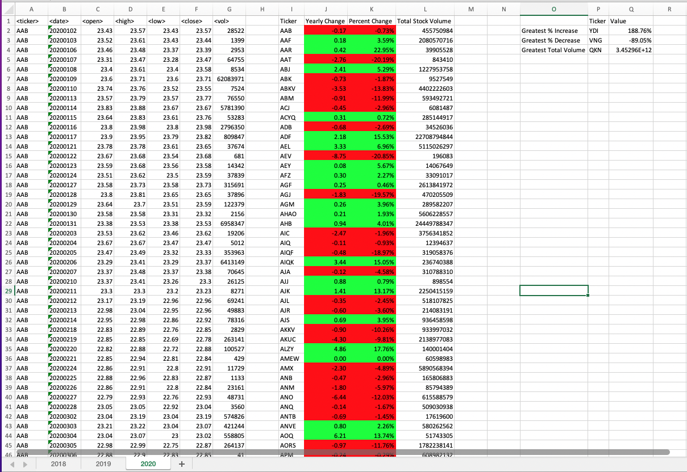

# Wall Street Data Analysis
Author: Rosie Gianan, gianr00@gmail.com

Build with: Excel, Visual Basic Application(VBA) 

## Objective:
Analyze the generated daily stock market data from 2018 to 2020 saved in multiple excel worksheets with one sheet for each year. Generate the yearly summary table showing the following for each ticket symbols:
- The yearly change from opening price at the beginning of a given year to the closing price at the end of that year.
- The percent change from opening price at the beginning of a given year to the closing price at the end of that year.
- The total stock volume of the stock.
- Display the stock with the "Greatest % increase", "Greatest % decrease", and "Greatest total volume". 

## Solution:
Create a Visual Basic Application (VBA) script that run on all sheets containing the stocks yearly data. The script loops though the list of stocks data and create the summary table containing the following data for each year:
1. Ticker – unique list of ticker symbols
2. Yearly Change – Price yearly change from the open price of the first trading date to the close price of the last trading date for each unique ticker symbols. 
3. Percent Change – Percent price yearly change from the open price of the first trading date to the close price of the last trading date for each unique ticker symbols. 
4. Total Stock Volume – Total stock volume for each unique ticker symbols

The script creates an additional summary table containing the following data for each year:
1. Greatest % Increase – The ticker symbol with the greatest % increase value for the year 
2. Greatest % Decrease – The ticker symbol with the greatest % decrease value for the year
3. Greatest Total Volume – The ticker symbol with the greatest total volume for the year

Sample summary table:  

 

